# Lab Quiz 1
In this lab, you will learn how to properly use Git and Github to manage your programming assignments.

This assignment is to be completed during lab in the second week of school. The due date for this lab is **Friday, September 2, 2022 @ 11:59pm CST**.

## Overview
Git and Github are industry tools that are used every day by software engineers all over the world!
Here we will use those tools to complete a short program, submit it via GitHub Desktop, and get realtime feedback on whether or 
not your program compiled / ran successfully!

Feel free to re-visit this document as you work through your programming assignments this semester. For each program (6 total), you will 
be repeating the steps you completed in this lab. 

## Part 1 - Accept the assignment
1. To start, visit the assignment details in Canvas. Then click on the **invite link**. 

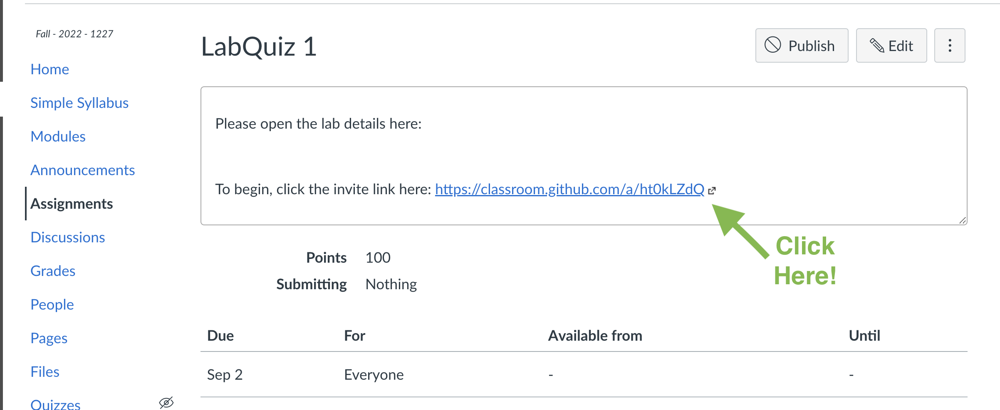


2. This will take you to a page that looks like this: 

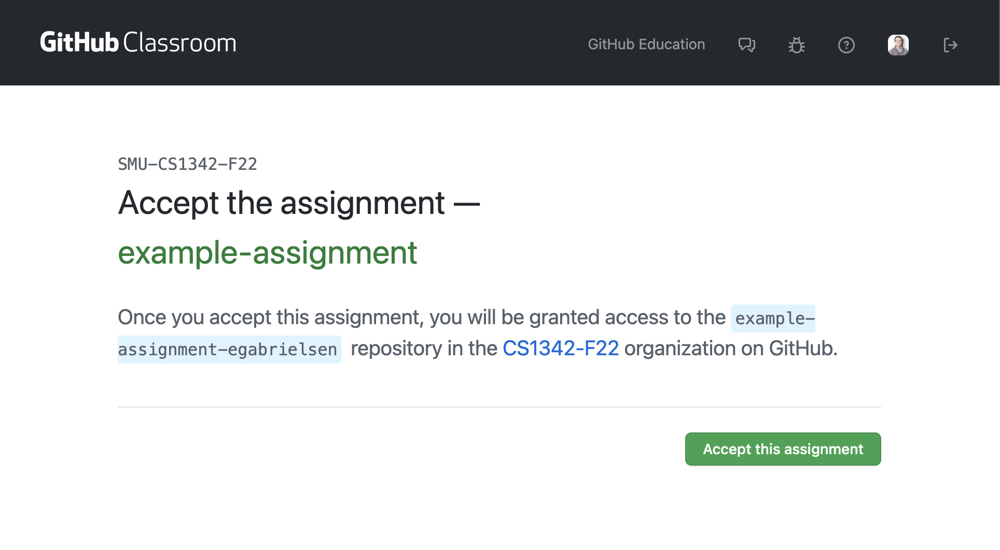

3. Click **Accept this assignment**. Once you do so you may see this page: 

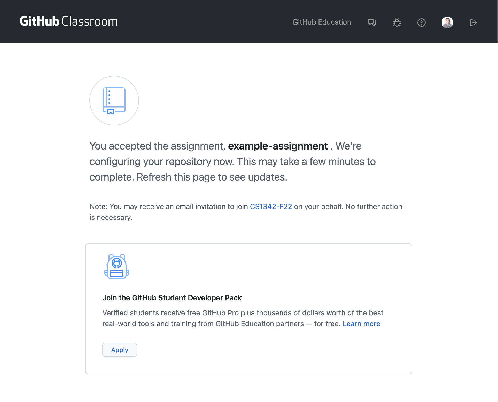

4. Continue re-freshing the screen until your repository is ready (you may also receive an email once it is). This should only take a few seconds. 

5. Once your repository has been created, click on the link that is present in the page below. This will take you to your repository!

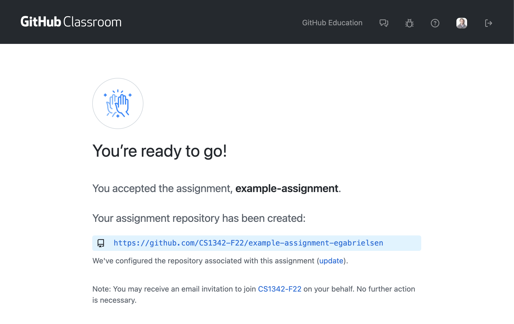

**Note: If you ever lose track of this link, thats OK. You can find ALL of your repositories in our GitHub organization for this class here: [https://github.com/CS1342-F22](https://github.com/CS1342-F22)**

## Part 2 - Clone your project!
1. Now that you have accepted the invite and your repository is created, it's time to get to work! First let us start by getting acquainted with your repository. When you visit your repository you should see something like this:


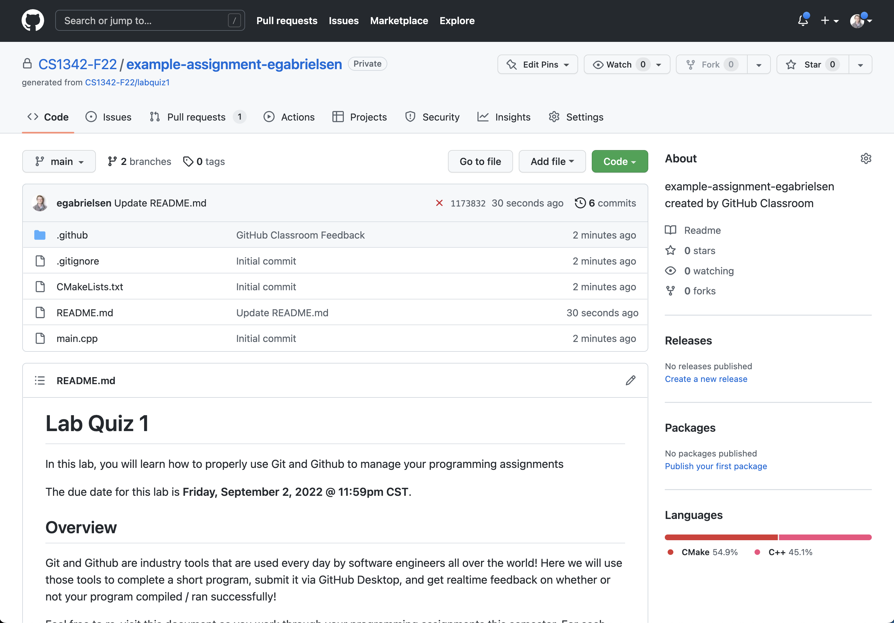

- The `code` tab is where all of your code lives - in the cloud. This allows you to access it from anywhere! Don't worry though - this repository is setup to be private, so only you, the TA's and your professor are able to view its contents. 
- If you click on any one of the files, you will be able to view its contents in github. Give it a try by clicking on `main.cpp`. You should see a hello world program!
- Now navigate back to your repository's root page. You may be wondering what all the other files / folders are. For now you can ignore them, they are files that CLion needs to compile and run your program. All we _really_ care about is `main.cpp`.

2. Now that we have our barrings, let's "clone" (github term for "download") your code so you can make changes! 

3. To do so, click on the green **Code** button that you see on your repository page. Then select **Open with GitHub Desktop**

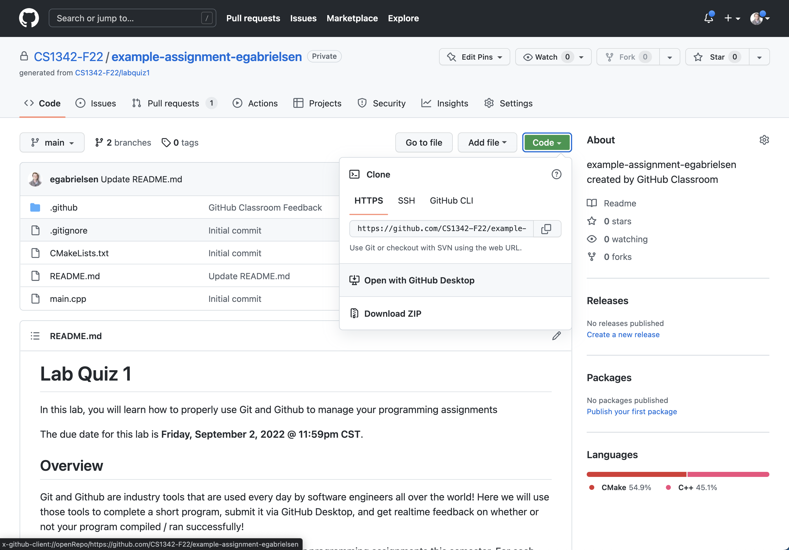

4. You should now see a screen that looks like the image below. The first text field is the repository url, we do not have to change this. The second text field labeled "Local Path" is where the contents of your repository are going to be saved on **your** computer. It is important that you Choose... a location that you remember and can refer back to later. 

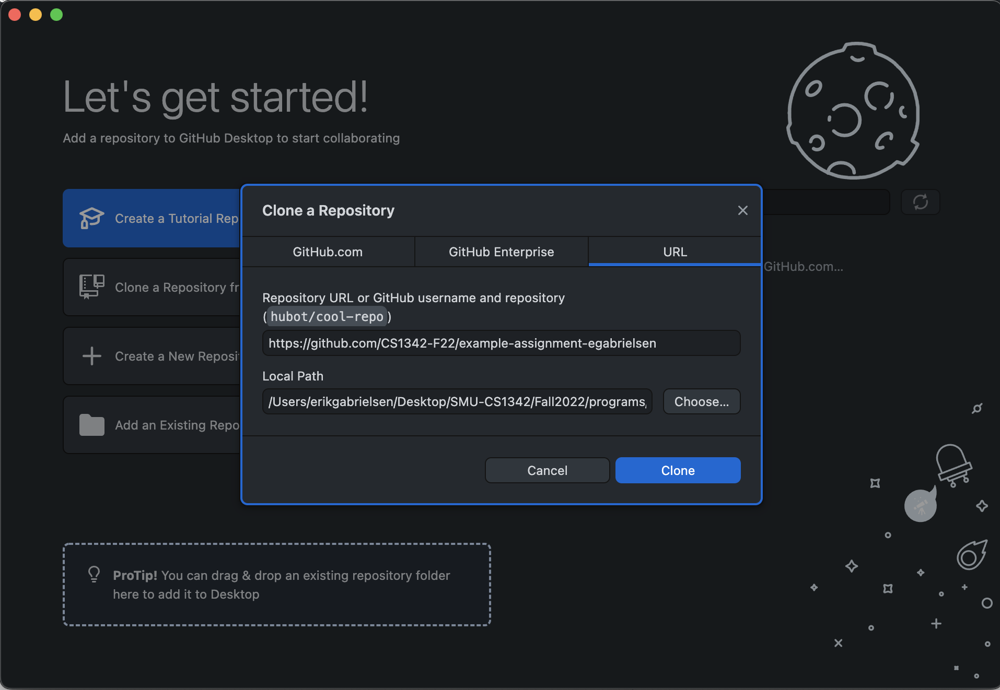

5. Once you have selected a location to "clone" your repository, click **Clone**. 

6. Now you should see something that looks like this in the GitHub Desktop application

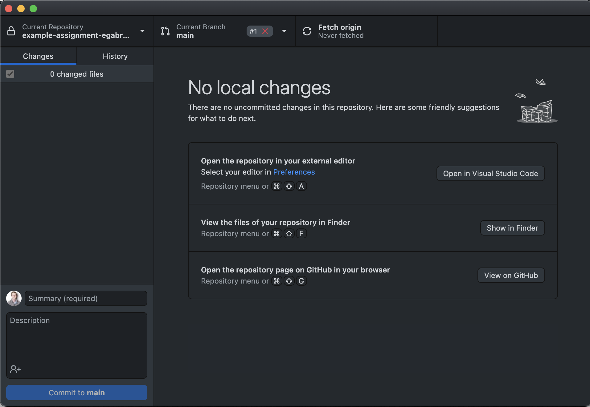

7. Great! Now its time to code!

## Part 3 - Make some changes
1. Now that we have a working copy of the assignment on your laptop or personal computer, its time to get coding! To do so let's start by opening up CLion!

2. Once CLion has started, now select **Open**. If you have a window already open just go to `File > Open`. 

3. Next, navigate to where you "cloned" your project. Once you find it, double click the `CMakeLists.txt` file. 

4. CLion will now ask you if you would like to open as a project. We do. So select **Open as Project**

5. This will open up your project in CLion! You are now ready to make some modifications to the program. 

6. First, start by just running the program to make sure it works! You should see "Hello, World!" printed to the console. If you do not, ask a TA for help!

7. Once you verify that everything is in working order, lets modify some code...

8. Change line 4 to instead of printing out "Hello, World!", to print "Hello, [first_name]!]" (Replace first_name with your actual First Name). 

9. Save the changes and run your program! If your name is John, you should now see the correct output which now says "Hello John!".

## Part 4 - Submitting your changes
1. Now that you have made changes to your code, lets open back up the GitHub Desktop Application. You should now see that you have changes to your program!

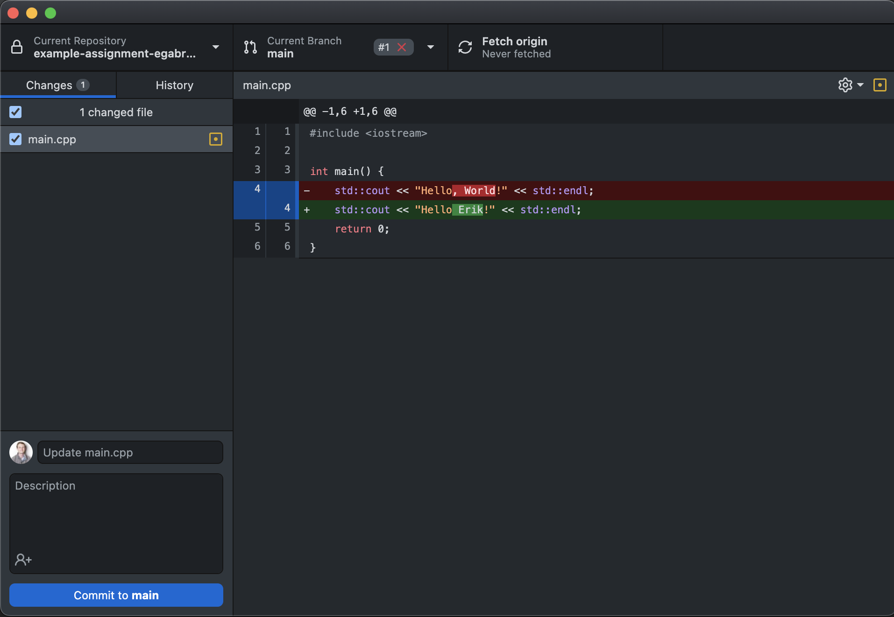

2. Cool! Notice how git tracks that you deleted the text ", World" and replaced it with " FirstName". Pretty neat! 

3. Next, in the lower left hand corner, you will see a section where you can leave a message, description, and a button that says "commit to main". Go ahead and click **Commit to main**. 

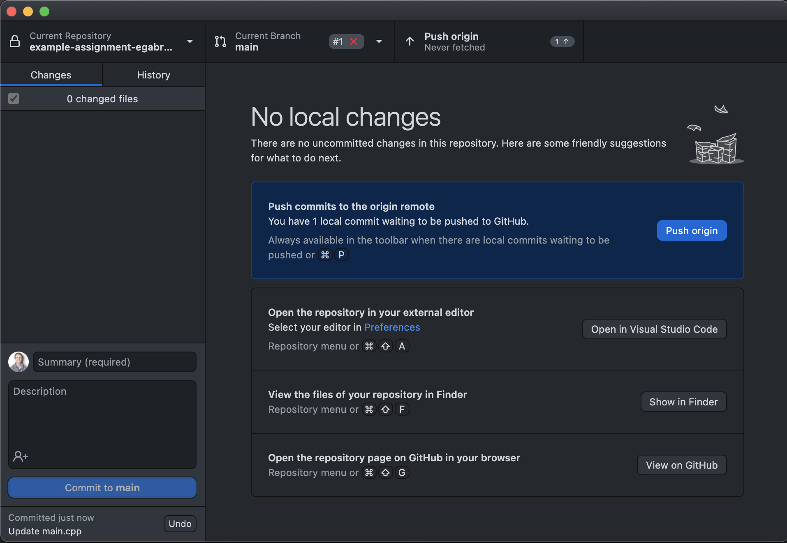

4. Now you will see this page (see above). At this point, your changes have been captured in a `commit` - a snapshot of your changes made to this repository that is now tracked in git (version control). Now we need to "push" (or upload) these changes back up to your repository on GitHub so that it can be graded. 

5. To "push" our code up to GitHub, click the **Push origin** button. 

6. Excellent! Now your changes are up in GitHub! To verify, visit the labquiz repository link in your browser once more. If you now click on `main.cpp` you will see that now your changes are there! 

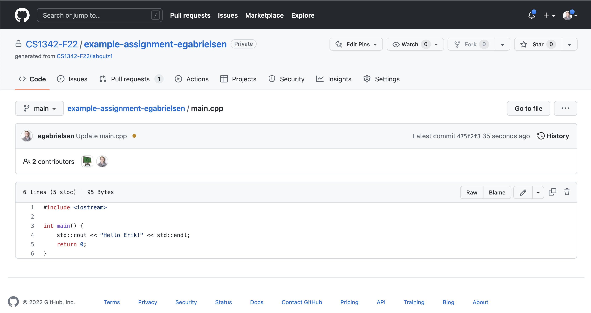

## Part 5 - Short Program
You may repeat Part 4 as many times as you like as you are developing your programs! I highly recommend that you submit changes to your code periodically throughout development.

To get some practice, let's create a short program that does the following: 

### Convert to Dollars
Given four values representing counts of quarters, dimes, nickels and pennies, output the total amount as dollars and cents.

Output each floating-point value with two digits after the decimal point, which can be achieved by executing
`cout << fixed << setprecision(2);` once before all other cout statements.

Ex: If the input is:

```
4 3 2 1
```
where 4 is the number of quarters, 3 is the number of dimes, 2 is the number of nickels, and 1 is the number of pennies, the output is:
```
Amount: $1.41
```
For simplicity, assume input is non-negative.

### Submit your changes
Once you are completed with your program, commit and push up your final changes (Using the same steps in part 4), then view your repository. Click on the **Pull Requests** Tab. 

For this lab, notice that when you visit that tab you see a Pull Request named "Feedback". This is an overview of all changes that have occurred to your program. This is a great tool where your graders and / or professors can take a look at your changes and provide feedback. You will also be able to see that your program compiled successfully by viewing "Checks" section towards the bottom. If all things are green you are good and it compiles successfully! Your grader will still be executing your code to make sure that things run smoothly and behave correctly. 

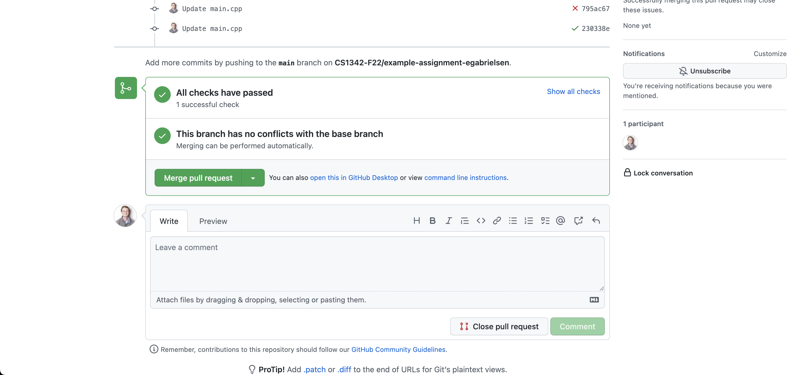

Congrats! You have just completed submitting your first program using Git / Github!